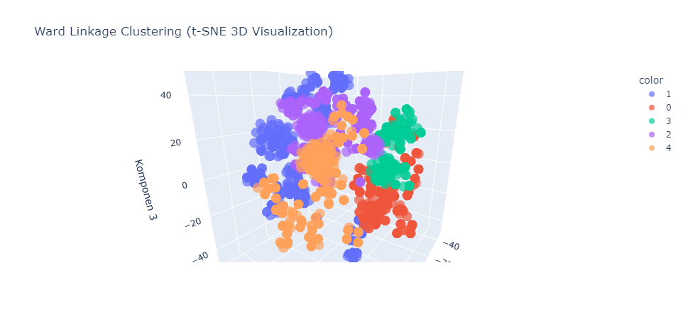

# Projek Belajar Machine Learning untuk Pemula
<br>
Sumber : [Data Science Dojo](https://datasciencedojo.com/blog/data-science-memes/)<br>

*Disclaimer : Penulis bukan makhluk sempurna, soo tell me kalo ada kekeliruan disini...*

## Cara Clone Repository

Untuk meng-clone repository ini, jalankan perintah berikut di terminal atau command prompt:

```bash
git clone https://github.com/anugerahsurya/ProjekClusteringLaskarAI-Surya.git
```

## Introduction
<br>
Sumber : [Data Science Dojo](https://datasciencedojo.com/blog/data-science-memes/)<br>
Yoo guys, jadi dah cukup lama ga update karena lagi di masa mendalami skripsi. Kali ini karena cukup bosen bahas skripsi mulu, aku mulai iseng join Laskar AI (yaa karena pengen juga si.) Nah programnya ini kaya kelas online gitu kerjasama Dicoding-NVIDIA-LintasArta. Sebenernya yang bikin *eye catching*-nya ini NVIDIA nya wkwkwk. Singkatnya, RTX itu kan dari NVIDIA yaa dan powerfull banget tuh GPU untuk running-running ML khususnya Deep Learning. Jadi harapannya semoga nanti ada momen NVIDIA minjamin dan bisa nyoba GPU *powerfull*-nya mereka wkwkwk. **okaay, without any further do, mari kita mulai pembahasan kodenya.**

## Business Understanding
*ini diskip aja lah yaa, soalnya gaa ada dasar pemilihan selain kesesuaian data ini sama kriteria penilaian penugasan wkwk.*

## Data Understanding
Nahh part ini penting banget nih guys, karena disini kita bakal mengetahui apa yang membuat data ini sesuai dengan apa yang kita kerjakan. Nah bedanya sama tahapan Preparation yaa karena disini belum ngasih treatment apa apa ni. Kita tau bahwa pada Dataset_Clustering.csv terdapat kurang lebih 40 kolom yang bisa digunakan dalam pemodelan, dimana 2 diantaranya kategorik *(age kategorik karena dari datanya aja ga clean)*. Nahh, selain itu kita harus mastiin disini gaada label (karena syarat penugasannya). Terus kita juga perlu ngidentifikasi kolom yang ga bermakna kaya ID, atau semacamnya. Cuma yaa bisa dipertimbangin jadiin Index DF kalau emang analisisnya butuh informasi individu.

## Data Preparation
Dalam pemrograman python, tentu supaya lebih rapi kita akan mulai dengan pendefinisian library yang digunakan. Mulai dari library dasar hingga library untuk evaluasi dan visualisasi hasil cluster. Selanjutnya kita akan muat datanya. **Exploratory Data Analysis** merupakan bagian dari tahapan ini lohh guys. Jadi kita bakal ngidentifikasi data melalui beberapa proses.

### 1.1 Memahami Struktur Data dan Pengecekan Missing Value
Tahapan ini penting banget nih gaes, karena data yang digunakan pada pemodelan harus benar-benar clean. Di kode ini kita bisa lihat bahwa tidak ada missing value pada dataset yang digunakan *(karena na udah di drop saat load data wkwkw)*. Kalo temen temen nemu missing tentu dapat menjadi catatan untuk dilakukan pemrosesan lanjutan seperti **Drop Missing Value ataupun Imputasi**.

### 1.2 Analisis Distribusi dan Korelasi
Tahapan ini berguna untuk mengecek distribusi data melalui ringkasan statistik dari data yang digunakan. Kalau di kode terlihat nilai **NaN** itu gara-gara datanya non numerik atau non kategorik, jadi ukuran yang dipilih itu all (keseluruhan). Gunanya yaa supaya kita tau sebaran data, contoh pada kolom Age masa Kategorik kan, terus nilai modusnya aja 16 Jan *(p maksud)*.

### 1.3 Visualisasi Data
Tahapan ini berguna untuk meninjau distribusi data namun secara visual nih. Kodenya cukup fleksibel jadi bakal nyesuain kalo temen-temen menggunakan data numerik dan kategorik tanpa harus dikasi treatment spesial. *(cuma di kode itu age gara-gara terlalu kacau udah diproses duluan)*

## Data Preprocessing
Tahap ini ga kalah penting nih temen temen. Pengalamanku pernah ngerjain pemodelan yang hasilnya signifikan berubah gara-gara ganti metode Standardisasi, kalo gasalah dari MinMaxScaler terus ganti ke RobustScaler gitu. Berdasarkan bacaan yang pernah aku baca jadi kalo temen punya data yang berdistribusi normal bakal bagus kalo make StandardScaler, kalo non normal pake MinMaxScaler, dan kalo banyak outlier RobustScaler bakal kece si. <br>

### 2.1 Cleaning Dataset dengan Menghilangkan kolom/variabel yang tidak relevan dan Missing Value
Karena tadi gaada missing value kita bisa skip si temen temen, cuma di kodenya tetep ditampilin. Oiyaa disini *treatment* yang dipilih adalah Drop Observasi. Ini bisa disesuaikan saja, kalau dataset terbatas tentu akan lebih baik kalo diimputasi. Kalau data *cross section* temen temen bisa pake mean, median, atau modus untuk imputasinya, kalau *time series* bisa pake interpolasi atau isi dengan lag nya. 

### 2.2 Identifikasi Duplikasi pada Dataset
Di kode itu, identifikasi duplikasi jika seluruh kolom pada suatu observasi bernilai sama dengan observasi lainnya. (biar cepet aja si wkwk). Alhamdulillahnya gaada duplikasi, jadi bisa lanjut ke tahap berikutnya tanpa berikan treatment apapun.

### 2.3 Transformasi variabel kategorik dengan Label Encoding
Oiyaa ada keliru gaes, harusnya dengan Label Encoder yaa, karena ini treatment untuk variabel gender doang (biner). Kalo pake One Hot nanti hasilnya bakal jadi 2 kolom, padahal artinya sama. Dimana One Hot Encoder itu akan menghasilkan kolom baru sebanyak kategori sehingga akan menyatakan k kolom, jika suatu observasi memiliki isian 1 di variabel awalnya artinya di variabel sisanya akan bernilai 0. *pastinya kalo biner ya bakal sama aja kan, karena kalo 1 nya 1 pasti 1 nya 0, begitu juga sebaliknya **multikol alert***. Selain itu disini juga dapat dilihat ada treatment lain pada kolom age, dimana diubah menjadi numerik lalu difilter agar usia antara 16 dan 20 saja. Oiyaa kelupaan, kalo pake Label Encoder dengan k kolom, maka isian kolom hasil transformasinya bakal (k-1), (k-2), ..., 0. gitu ya gaes, jadi kalo kategorinya banyak dan temen temen make ini untuk variabel X sebenernya kurang efisien, apalagi di supervised learning, karena nilai itu kan dianggap sebagai urutan ya, padahal aslinya nominal *(non numerik dan tanpa urutan)*. Di kodenya Female diubah jadi 0 dan Male jadi 1.

### 2.4 Uji Korelasi antara variabel yang sudah diproses menjadi numerik
Yaa ini sebagai syarat aja wkwkw. aslinya ya temen temen bisa identifikasi nih hubungan linier antara variabelnyaa. Walaupun terkadang kalo kita make model *machine learning* atau *deep learning*, nilai itu kurang relevan karena konsepnya emang pemodelan non linier. Tapi penting karena jika kontribusinya emang besar, variabel tersebut tetap punya nilai *feature importance* yang tinggi.

### 2.5 Standardisasi Data
<br>
Sumber : [Medium](https://medium.com/alliedoffsets/standardization-the-secret-to-better-data-science-fa2cb6b30c01)<br>
Pada kode ini menggunakan MinMaxScaler karena yaa pengen cepet aja. Yaa di akhir juga dicoba coba si mana yang ngehasilin silhouette paling tinggi, tapi yaa tetep MinMax paling bagus jadi yaudah.

### 2.6 Eliminasi Outlier
Nahh disini make algoritma *Isolation Forest* nih temen temen. Karena kalo pake IQR di boxplot itu kaya univariate gitu, jadi yaudah sekalian ini aja. Isolation Forest ini merupakan algoritma clustering sehingga bertujuan membentuk 1 cluster. *(Tujuan cluster membuat kondisi homogen dalam cluster)*. Sehingga kalo observasinya di luar cluster artinya outlier yang tentunya mempertimbangkan kondisi seluruh variabel. [Baca Disini](https://arxiv.org/pdf/2206.06602)

## Modelling dan Evaluation
Nah kita masuk ke core thing di kode ini yaitu pemodelan. Aku make 2 metode yaitu Hierarchical dengan Ward Linkage dan Partitioning dengan [KMeans](https://doi.org/10.1007/978-0-387-30164-8_425).

### 3.1 Pendefinisian Algoritma Clustering yang Digunakan
Pendefinisiannya yaa gitu aja terus disana juga data X nya diinisialisasi ke variabel baru supaya nanti bisa dipanggil lagi (kalau).

### 3.2 Identifikasi Cluster Optimal dan Pembentukan Model Cluster
Penentuan cluster optimal disini menggunakan [*metode Elbow*](https://www.geeksforgeeks.org/elbow-method-for-optimal-value-of-k-in-kmeans/). Metode ini umum digunakan karena lebih mudah dipahami. Disini juga didefinisikan rentangnya itu untuk k = 2 hingga 10. Selanjutnya dibentuk cluster dan dihitung skor silhouette nya. Cuma kecil bgt nih, karena silhouette bakal lebih bagus kalau mendekati 1.

### 3.3 Feature Selection
Tahapan selanjutnya yaitu Feature Selection. Disini saya menggunakan 3 cara yaitu [MutualInfo](https://doi.org/10.48550/arXiv.2209.10058), PCA untuk reduksi dimensi, dan VIF untuk meninjau multikol. Dari ketiga cara tersebut diperoleh nilai optimal itu mengacu dengan fitur yang dihasilkan MutualInfoClassifier saat diterapkan pada Ward Linkage. Selain itu pada bagian atas kode juga didefinisikan bahwa fitur yang dikurangi itu di nilai minimum antara 5 dan jumlah var - 1. Tujuannya supaya interpretasinya lebih mudah aja.

### 3.4 Visualisasi Hasil Clustering

Tahapan visualisasi sebenernya ada banyak opsi nih temen temen, seperti PCA, Kernel PCA, t-SNE untuk reduksi komponen dan gunakan scatter plot untuk visualisasinya. Gunanya reduksi komponen adalah agar dapat divisualisasikan pada dimensi rendah *(awalnya kan ada 5 var yaa karena hasil reduksi, tapi 5 dimensi pastinya masih belum bisa divisualkan)*. Nah disini dipake [t-SNE](https://lvdmaaten.github.io/tsne/) karena merupakan reduksi komponen namun menggunakan kombinasi non linier *kalo PCA ga bisa karena menggunakan kombinasi linier*, Hal ini berguna supaya *Explained Variance* untuk jumlah komponen yang minimum lebih tinggi. Sehingga karakteristik cluster akan lebih mudah dilihat.

### 3.5 Analisis dan Interpretasi Hasil Cluster
Tahapan selanjutnya perlu inverse transform karena tadi distandardisasi pake MinMax. Nah setelah itu dibentuk dataframe baru untuk profilisasi clusternya. Tapi perhatiin temen-temen kode ini belum diset random state untuk clusternya, jadi running berkali-kali bakal beda terus hasilnya heheehe.

<br>
Sumber : [Data Science Dojo](https://datasciencedojo.com/blog/data-science-memes/)<br>


